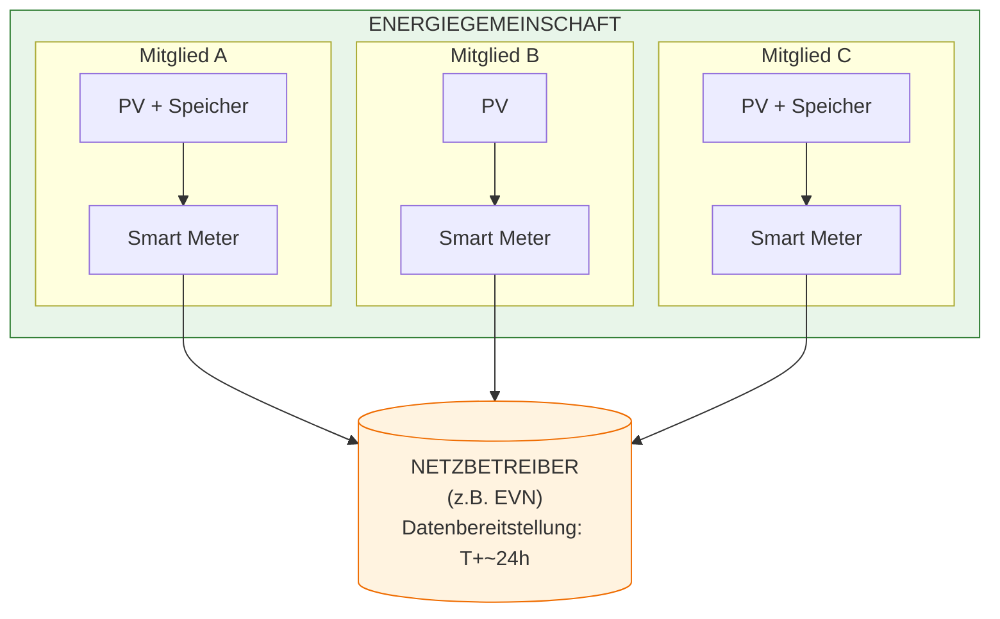
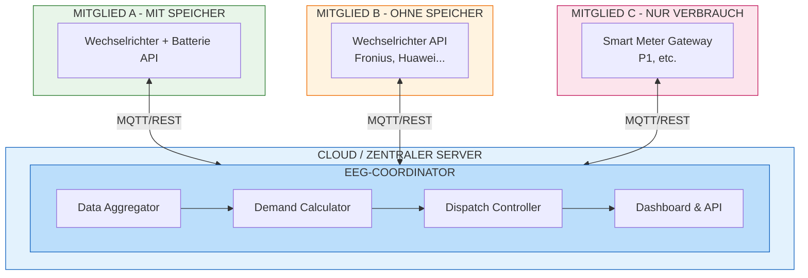
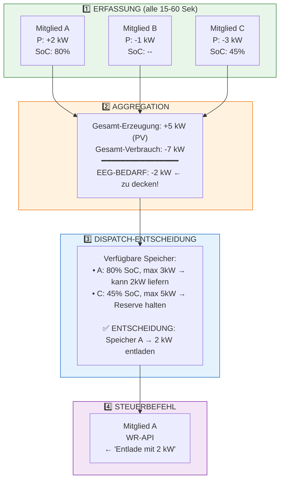
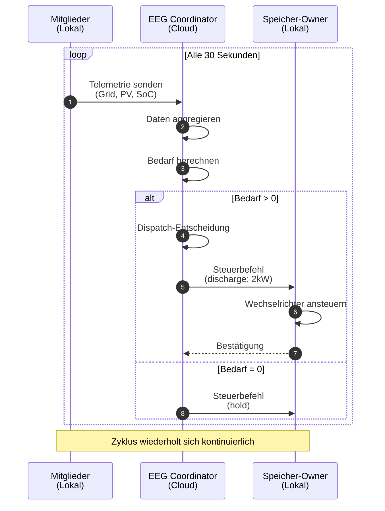
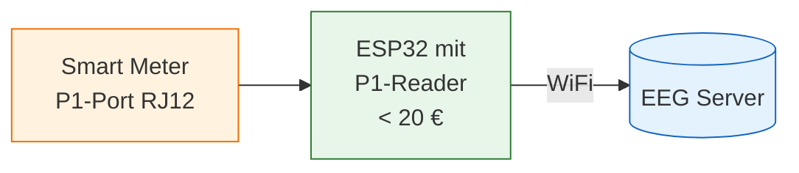
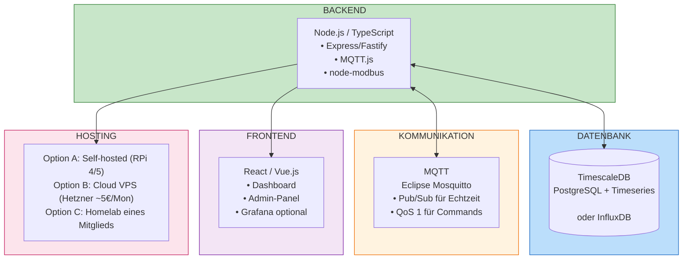
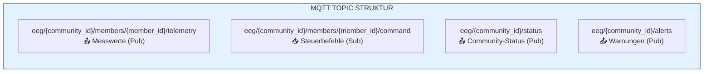
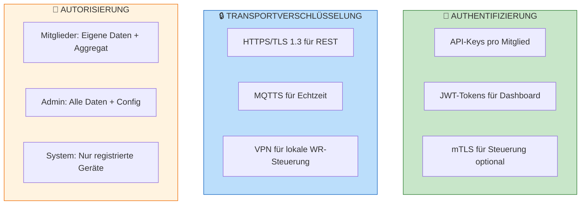
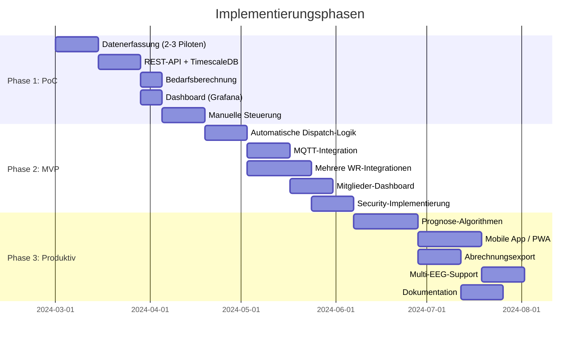
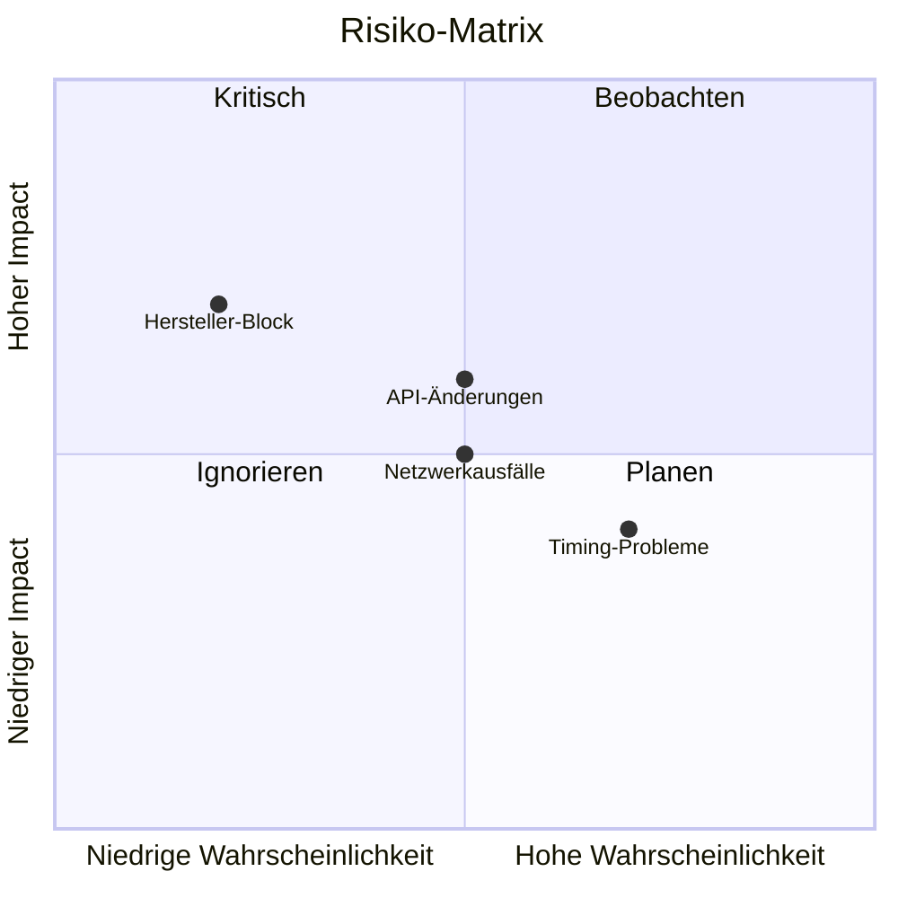

# EEG-Speichersteuerung: Open-Source-Konzept für dynamische Batterieentladung

## Executive Summary

Energiegemeinschaften (EEGs) in Österreich stehen vor dem strukturellen Problem der zeitgleichen Erzeugung und des zeitgleichen Verbrauchs. Diese Lösung ermöglicht die koordinierte Entladung von Batteriespeichern einzelner Mitglieder, um den Eigenverbrauch innerhalb der EEG zu maximieren und höhere Vergütungen zu erzielen.

---

## 1. Problemanalyse

### 1.1 Ausgangssituation



### 1.2 Kernprobleme

| Problem | Auswirkung |
|---------|------------|
| **Zeitgleiche Erzeugung** | Mittags haben alle PV-Überschuss → niemand nimmt ab |
| **Zeitgleicher Verbrauch** | Abends/nachts haben alle Bedarf → niemand kann liefern |
| **Verzögerte Daten** | Netzbetreiber liefert Viertelstundenwerte erst am Folgetag |
| **Keine Koordination** | Speicher entladen unkoordiniert → Überschuss geht ins öffentliche Netz |

---

## 2. Anforderungskatalog

### 2.1 Funktionale Anforderungen

#### Must-Have (MVP)

| ID | Anforderung | Beschreibung |
|----|-------------|--------------|
| F01 | **Echtzeit-Verbrauchserfassung** | Erfassung des aktuellen Stromverbrauchs aller teilnehmenden Mitglieder |
| F02 | **Echtzeit-Erzeugungserfassung** | Erfassung der aktuellen PV-Erzeugung aller teilnehmenden Mitglieder |
| F03 | **Bedarfsberechnung** | Ermittlung des aktuellen EEG-Gesamtbedarfs (Verbrauch - Erzeugung) |
| F04 | **Speichersteuerung** | Ansteuerung von Batteriespeichern zur bedarfsgerechten Entladung |
| F05 | **Priorisierung** | Verteilung der Entladung auf mehrere Speicher nach definierten Regeln |
| F06 | **Sicherheitsgrenzen** | Einhaltung von Min-SoC, Max-Entladeleistung, etc. |

#### Should-Have (Phase 2)

| ID | Anforderung | Beschreibung |
|----|-------------|--------------|
| F07 | **Prognose** | Vorhersage von Erzeugung und Verbrauch für optimierte Planung |
| F08 | **Abrechnungsintegration** | Export für EEG-Abrechnungssysteme |
| F09 | **Dashboard** | Visualisierung für Mitglieder und EEG-Verwaltung |
| F10 | **Benachrichtigungen** | Alerts bei Störungen oder Optimierungspotenzial |

#### Could-Have (Phase 3)

| ID | Anforderung | Beschreibung |
|----|-------------|--------------|
| F11 | **Dynamische Strompreise** | Integration von Börsenpreisen für zusätzliche Optimierung |
| F12 | **Lastverschiebung** | Steuerung von flexiblen Verbrauchern (Wärmepumpen, E-Autos) |
| F13 | **Multi-EEG** | Unterstützung mehrerer Energiegemeinschaften |

### 2.2 Nicht-funktionale Anforderungen

| ID | Anforderung | Spezifikation |
|----|-------------|---------------|
| NF01 | **Latenz** | Reaktionszeit < 180 Sekunden |
| NF02 | **Verfügbarkeit** | 99.5% Uptime (≈1,8 Tage Downtime/Jahr akzeptabel) |
| NF03 | **Skalierbarkeit** | 5-5000 Teilnehmer |
| NF04 | **Datenschutz** | DSGVO-konform, Datenminimierung |
| NF05 | **Sicherheit** | Verschlüsselte Kommunikation, Authentifizierung |
| NF06 | **Kosten** | < 50 € Hardware pro Teilnehmer (idealerweise 0 €) |
| NF07 | **Open Source** | Lizenz: MIT oder Apache 2.0 |

---

## 3. Systemarchitektur

### 3.1 Architekturübersicht



### 3.2 Datenfluss



### 3.3 Sequenzdiagramm: Typischer Zyklus



---

## 4. Komponenten im Detail

### 4.1 Zentrale Komponenten (Server/Cloud)

#### 4.1.1 Data Aggregator

**Funktion:** Sammelt und normalisiert Daten aller Teilnehmer

**Technologie-Optionen:**

| Option | Vorteile | Nachteile |
|--------|----------|-----------|
| **Node.js + InfluxDB** | Schnell, bewährt für IoT | Mehr Coding erforderlich |
| **Node.js + TimescaleDB** | PostgreSQL-Ökosystem, SQL-basiert | Etwas komplexer als InfluxDB |

**Empfehlung:** Node.js/TypeScript mit InfluxDB oder TimescaleDB

**Datenmodell:**
```typescript
interface MemberData {
  memberId: string;
  timestamp: Date;
  gridPower: number;      // W, positiv = Export, negativ = Import
  pvPower: number;        // W, Erzeugung
  batteryPower: number;   // W, positiv = Entladung
  batterySoC: number;     // %, State of Charge
  batteryCapacity: number; // Wh
  maxDischargePower: number; // W
}

interface AggregatedDemand {
  timestamp: Date;
  totalGeneration: number;  // W
  totalConsumption: number; // W
  netDemand: number;        // W, positiv = EEG braucht Strom
  availableStorage: StorageUnit[];
}
```

#### 4.1.2 Demand Calculator

**Funktion:** Berechnet aktuellen EEG-Bedarf und prognostiziert kurzfristig

**Algorithmus (vereinfacht):**
```python
def calculate_demand(members: List[MemberData]) -> float:
    total_generation = sum(m.pv_power for m in members)
    total_consumption = sum(abs(m.grid_power) for m in members if m.grid_power < 0)
    total_export = sum(m.grid_power for m in members if m.grid_power > 0)
    
    # Netto-Bedarf: Was die EEG insgesamt aus dem Netz bezieht
    net_demand = total_consumption - total_generation - total_export
    
    return max(0, net_demand)  # Nur positiver Bedarf relevant
```

#### 4.1.3 Dispatch Controller

**Funktion:** Entscheidet, welcher Speicher wie viel entlädt

**Priorisierungsregeln:**

1. **SoC-basiert:** Speicher mit höchstem SoC zuerst
2. **Kapazitätsbasiert:** Größere Speicher bevorzugen (weniger Zyklen)
3. **Fair-Share:** Gleichmäßige Verteilung über Zeit
4. **Manuell:** Mitglieder können Präferenzen setzen

**Dispatch-Algorithmus visualisiert:**

```mermaid
flowchart TD
    START([Bedarf berechnet]) --> CHECK{Bedarf > 0?}
    CHECK -->|Nein| HOLD[Alle Speicher: HOLD]
    CHECK -->|Ja| SORT[Speicher nach SoC sortieren<br>höchster zuerst]
    
    SORT --> LOOP{Weiterer Speicher<br>verfügbar?}
    LOOP -->|Nein| END([Dispatch abgeschlossen])
    LOOP -->|Ja| CHECKSOC{SoC > Min-SoC?}
    
    CHECKSOC -->|Nein| SKIP[Speicher überspringen]
    SKIP --> LOOP
    
    CHECKSOC -->|Ja| CALC[Max verfügbare Leistung<br>berechnen]
    CALC --> ASSIGN[Leistung zuweisen:<br>min'(verfügbar, Restbedarf')']
    ASSIGN --> UPDATE[Restbedarf aktualisieren]
    UPDATE --> CHECKDONE{Restbedarf = 0?}
    
    CHECKDONE -->|Ja| END
    CHECKDONE -->|Nein| LOOP
    
    style START fill:#c8e6c9,stroke:#2e7d32
    style END fill:#c8e6c9,stroke:#2e7d32
    style HOLD fill:#ffecb3,stroke:#ff8f00
```

### 4.2 Lokale Komponenten (bei Mitgliedern)

#### 4.2.1 Datenerfassung ohne zusätzliche Hardware

**Option A: Wechselrichter-API (bevorzugt)**

| Hersteller | API | Daten | Steuerung |
|------------|-----|-------|-----------|
| **Fronius** | Solar API (lokal) | PV, Batterie, Grid | Ja (Modbus) |
| **SMA** | Sunny Portal API | PV, Batterie, Grid | Ja (Modbus) |
| **Huawei/FusionSolar** | Cloud API + lokale Modbus | PV, Batterie, Grid | Ja (Modbus) |
| **Kostal** | REST API (lokal) | PV, Batterie, Grid | Begrenzt |
| **GoodWe** | SEMS Portal API | PV, Batterie, Grid | Ja |
| **Victron** | VRM API + lokale MQTT | Alles | Ja |
| **Enphase** | API (Cloud) | PV | Nein |

**Beispiel Fronius:**
```bash
# Lokale API (im Heimnetz)
curl http://192.168.1.100/solar_api/v1/GetPowerFlowRealtimeData.fcgi

# Response:
{
  "Body": {
    "Data": {
      "Site": {
        "P_Grid": -1500,      // Negativ = Bezug aus Netz
        "P_Load": 2000,       // Hausverbrauch
        "P_PV": 3500          // PV-Erzeugung
      },
      "Inverters": {
        "1": {
          "Battery_Mode": "discharge",
          "SOC": 75
        }
      }
    }
  }
}
```

**Option B: Smart Meter P1-Port**



**Hardware:**
- ESP32 mit P1-Adapter: ~15-20 €
- Fertige Lösungen: SlimmeLezer+ (~35 €), HomeWizard P1 Meter (~30 €)

**Option C: Lokaler Adapter (z.B. Node.js Script oder Plugin)**

Für Mitglieder, die einen bestehenden lokalen Hub verwenden (z.B. als Home Assistant Plugin), kann ein einfacher Adapter entwickelt werden, der:
- Daten vom Wechselrichter liest
- Diese per MQTT/REST an den EEG-Server sendet
- Steuerbefehle empfängt und an den Wechselrichter weiterleitet

#### 4.2.2 Speichersteuerung

**Modbus TCP (lokal, empfohlen):**

```python
from pymodbus.client import ModbusTcpClient

class FroniusBatteryController:
    def __init__(self, host: str):
        self.client = ModbusTcpClient(host, port=502)
    
    def set_discharge_power(self, power_watts: int):
        """Setze Entladeleistung (0 = aus, positiv = Entladung)"""
        # Fronius Modbus Register für Batteriesteuerung
        # Register 40349: Storage Control Mode (1 = Remote Control)
        # Register 40350: Target Power (W)
        
        self.client.connect()
        self.client.write_register(40349, 1, unit=1)  # Remote Mode
        self.client.write_register(40350, power_watts, unit=1)
        self.client.close()
    
    def stop_discharge(self):
        self.set_discharge_power(0)
```

---

## 5. Technologie-Stack Empfehlung

### 5.1 MVP-Stack



---

## 6. Schnittstellen-Spezifikation

### 6.1 API-Endpunkte

```yaml
openapi: 3.0.0
info:
  title: EEG Coordinator API
  version: 1.0.0

paths:
  /api/v1/members/{memberId}/report:
    post:
      summary: Melde aktuelle Messwerte
      requestBody:
        content:
          application/json:
            schema:
              type: object
              properties:
                timestamp:
                  type: string
                  format: date-time
                gridPower:
                  type: number
                  description: Watt, positiv=Export
                pvPower:
                  type: number
                batterySoC:
                  type: number
                batteryPower:
                  type: number
      responses:
        '200':
          description: OK
          content:
            application/json:
              schema:
                type: object
                properties:
                  command:
                    type: string
                    enum: [none, discharge, charge, hold]
                  targetPower:
                    type: number
                  validUntil:
                    type: string
                    format: date-time

  /api/v1/community/status:
    get:
      summary: Aktueller EEG-Status
      responses:
        '200':
          description: OK
```

### 6.2 MQTT Topics



**Beispiel-Nachrichten:**

```json
// Telemetry (Member → Server)
{
  "ts": "2024-01-15T14:30:00Z",
  "grid": -1500,
  "pv": 3500,
  "bat_soc": 75,
  "bat_power": 0
}

// Command (Server → Member)
{
  "cmd": "discharge",
  "power": 2000,
  "valid_until": "2024-01-15T14:35:00Z",
  "reason": "eeg_demand"
}
```

---

## 7. Sicherheit & Datenschutz

### 7.1 Sicherheitsarchitektur



### 7.2 Datenschutz (DSGVO)

| Aspekt | Maßnahme |
|--------|----------|
| **Datenminimierung** | Nur notwendige Daten (Leistung, SoC), keine personenbezogenen Daten |
| **Speicherbegrenzung** | Aggregierte Daten: 2 Jahre, Rohdaten: 30 Tage |
| **Pseudonymisierung** | Member-IDs statt Namen, Mapping nur bei EEG-Admin |
| **Transparenz** | Dashboard zeigt alle gespeicherten Daten |
| **Löschrecht** | Export- und Löschfunktion für Mitglieder |

### 7.3 Sicherheitsgrenzen für Speichersteuerung

```python
class SafetyLimits:
    MIN_SOC = 10          # Niemals unter 10% entladen
    MAX_DISCHARGE_RATE = 1.0  # Max C-Rate (1C = volle Kapazität/Stunde)
    COMMAND_TIMEOUT = 300     # Befehl verfällt nach 5 Minuten
    MAX_COMMANDS_PER_HOUR = 12  # Max 12 Änderungen/Stunde
    
    def validate_command(self, storage, command):
        if storage.soc - command.energy/storage.capacity*100 < self.MIN_SOC:
            raise SafetyError("Would discharge below MIN_SOC")
        if command.power > storage.capacity * self.MAX_DISCHARGE_RATE:
            raise SafetyError("Exceeds MAX_DISCHARGE_RATE")
        return True
```

---

## 8. Implementierungsplan

### 8.1 Phasen



---

## 9. Offene Fragen & Risiken

### 9.1 Technische Risiken



| Risiko | Wahrscheinlichkeit | Mitigation |
|--------|-------------------|------------|
| Wechselrichter-API-Änderungen | Mittel | Abstraktionsschicht, Community-Updates |
| Netzwerkausfälle | Mittel | Lokale Fallback-Logik, Timeout-Handling |
| Timing-Probleme | Hoch | Toleranzen einbauen, 15-min-Intervalle |
| Hersteller blockiert Steuerung | Gering | Alternative: lokale Modbus-Steuerung |

### 9.2 Rechtliche Fragen

| Frage | Status |
|-------|--------|
| Ist dynamische Speichersteuerung für EEG-Einspeisung erlaubt? | ✅ Ja, keine Einschränkungen bekannt |
| Haftung bei Speicherschäden durch Fernsteuerung? | ⚠️ Zu klären, Haftungsausschluss empfohlen |
| Datenschutz bei zentraler Verbrauchserfassung? | ✅ DSGVO-konform mit Maßnahmen aus Kap. 7 |
| Eichrechtskonformität? | ℹ️ Nicht relevant, da keine Abrechnung über eigene Zähler |

### 9.3 Nächste Schritte

1. **Technisch:** 
   - Inventar der Wechselrichter/Speicher in der EEG erstellen
   - 2-3 Pilotmitglieder mit Home Assistant identifizieren
   - Test-Setup mit einem Speicher aufbauen

2. **Organisatorisch:**
   - EEG-Vorstand informieren und Freigabe holen
   - Haftungsfragen mit Rechtsberatung klären
   - Interesse für Open-Source-Beiträge in Community abfragen

3. **Entwicklung:**
   - GitHub-Repository erstellen
   - Architektur-Entscheidungen dokumentieren (ADR)
   - CI/CD-Pipeline aufsetzen

---

## Anhang A: Wechselrichter-Kompatibilitätsliste

| Hersteller | Modelle | API-Typ | Lese-Daten | Steuerung | Dokumentation |
|------------|---------|---------|------------|-----------|---------------|
| Fronius | Symo, Primo, Gen24 | REST + Modbus | ✅ | ✅ | [Link](https://www.fronius.com/en/solar-energy/installers-partners/technical-data/all-products/system-monitoring/open-interfaces/fronius-solar-api-json-) |
| SMA | Sunny Boy, Tripower | Modbus | ✅ | ✅ | [Link](https://www.sma.de/en/products/monitoring-control/modbus-protocol-interface) |
| Huawei | SUN2000 | Modbus + FusionSolar | ✅ | ✅ | [Link](https://support.huawei.com/enterprise/en/doc/EDOC1100136627) |
| Kostal | Plenticore, PIKO | REST | ✅ | ⚠️ | [Link](https://www.kostal-solar-electric.com) |
| GoodWe | ET, EH, BH | SEMS API | ✅ | ✅ | Cloud API |
| Victron | MultiPlus, Quattro | MQTT (Venus) | ✅ | ✅ | [Link](https://www.victronenergy.com/live/venus-os:mqtt) |
| BYD | HVS, HVM, LVS | Via WR | ✅ | Via WR | - |
| Tesla | Powerwall | REST (lokal) | ✅ | ⚠️ | Unofficial |

## Anhang B: Glossar

| Begriff | Erklärung |
|---------|-----------|
| **EEG** | Erneuerbare-Energie-Gemeinschaft (österreichisches Modell) |
| **SoC** | State of Charge - Ladezustand der Batterie in % |
| **P1-Port** | Standardisierte Schnittstelle an Smart Metern |
| **Modbus** | Industrieprotokoll für Gerätesteuerung |
| **Dispatch** | Zuteilung/Verteilung von Ressourcen (hier: Speicherentladung) |
| **C-Rate** | Lade-/Entladerate relativ zur Kapazität (1C = volle Kapazität/h) |